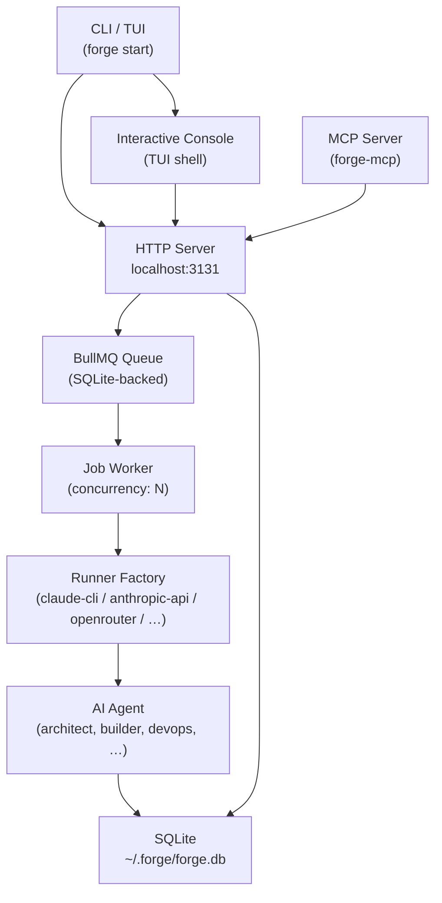

# Forge

**Forge is a CLI-first AI workflow operating system for software teams.**

You describe work — a feature, a bug fix, a refactor. Forge routes it through a team of specialized AI agents, tracks every step, surfaces the output, and asks for your approval when it matters. You stay in control; the agents do the work.

```bash
forge init
forge start
forge feature create "add login screen" --mode structured
forge bug create "fix crash on launch" --mode fast
```

Forge runs the orchestration layer entirely on your machine. It uses whatever AI CLI or API key you already have — Claude Code, Gemini CLI, Codex, or a direct API key. When you use API-based providers (OpenRouter, Anthropic API, Gemini API), requests go to those services as normal.

---

## What problem does Forge solve?

Running AI agents on real engineering tasks requires more than a single prompt. You need a pipeline of specialized agents that hand off to each other, checkpoints where you can review and redirect, logs you can inspect when something goes wrong, and a runtime that manages concurrency, retries, and budgets.

Forge is that runtime. It turns AI agents into a structured, inspectable, manageable team — not a black box.

---

## Core concepts

| Concept | What it means |
|---|---|
| **Issue / request** | A piece of work you submit. Can be a feature, bug, refactor, or release. |
| **Workflow** | The running execution of an issue, moving through stages and producing artifacts at each step. |
| **Step** | One unit of work inside a workflow — assigned to one agent, with a specific input and typed output. |
| **Approval** | A pause point where Forge asks you to confirm before proceeding. Required for budget overrides, harness decisions, and other high-stakes actions. |
| **Agent** | A named AI worker with a specific role (architect, builder, devops, etc.) and a configured provider/model. |
| **Console / TUI** | The interactive terminal UI that opens when you run `forge start`. |
| **fast** | Execution mode for straightforward tasks. Quick, no planning phase. |
| **structured** | Execution mode for larger work. Adds planning, sprint contracts, build verification, and approval checkpoints. |

---

## fast vs structured

When you create work, you choose how it runs.

**fast** — routes directly into the standard pipeline with no planning phase:
```
intake-gate → architect → builder → quality-guard → devops
```
Right for bug fixes, small features, anything you can describe in one sentence.

**structured** — activates the harness execution framework. A planner agent first decomposes the work into a `ProductSpec`, then each sprint goes through a contract → review → build → evaluate cycle. Right for larger features where you want planning, checkpoints, and the ability to redirect mid-flight.

```bash
forge bug create "fix null pointer in auth" --mode fast
forge feature create "rebuild the onboarding flow" --mode structured
```

> See [docs/harness.md](docs/harness.md) for a detailed explanation of the structured pipeline and how harness works internally.

---

## Quickstart

**Prerequisites:** Node.js 18+ and at least one AI runtime (`claude`, `gemini`, `codex`, or an API key).

```bash
# 1. Install
git clone https://github.com/halilozdemr/forge.git
cd forge && npm install && npm run build && npm link

# 2. Initialize your project
cd my-project
forge init

# 3. Start Forge
forge start

# 4. Submit work (or press n in the console)
forge feature create "add CSV export" --mode fast
forge feature create "add multi-tenant support" --mode structured
forge bug create "crash on empty email submission" --mode fast
```

`forge init --yes` skips interactive prompts. The generated `.forge/config.json` is gitignored by default.

---

## The Console (TUI)

`forge start` boots the runtime and opens the **Forge Console** — your main dashboard.

```
 FORGE CONSOLE  OVERVIEW                          localhost:3131  14:03:22
────────────────────────────────────────────────────────────────────────────
  queue: 2 running  0 pending  0 failed
  agents: 6 total  2 running  4 idle
  live ●

────────────────────────────────────────────────────────────────────────────
 [o] overview  [w] workflows  [a] approvals  [l] logs  [n] new  [r] refresh  [q] quit
```

| Key | View | What you see |
|---|---|---|
| `o` | Overview | Queue depth, agent counts, heartbeat status |
| `w` | Workflows | All workflow runs with status and progress |
| `a` | Approvals | Pending approval requests |
| `l` | Logs | Live streaming agent output |
| `n` | New task | Create a feature or bug task |

**In a list view:** `↑↓` to navigate, `Enter` to open detail, `Esc` to go back.

**In workflow detail:** `↑↓` scroll, `r` refresh.

**In approval detail:** `a` approve, `r` reject, `Esc` back.

**In logs:** `h` toggle heartbeat noise, `e` toggle warn/error only, `p` pause, `c` clear.

**Headless mode** (CI, non-TTY, or raw log output):
```bash
forge start --headless
```
Runtime starts without the console. HTTP server still available at `http://localhost:3131`.

> See [docs/console.md](docs/console.md) for a full TUI reference.

---

## Main commands

```bash
# System
forge init                          # initialize project config
forge start                         # start runtime + open console
forge start --headless              # start without console (raw logs)
forge start --port 3200 --concurrency 5
forge stop                          # gracefully stop the server
forge status                        # queue, agents, heartbeat state
forge doctor                        # check prerequisites

# Work
forge feature create "<title>"
forge feature create "<title>" --mode fast|structured
forge feature create "<title>" --description "<details>"
forge bug create "<title>"
forge bug create "<title>" --mode fast|structured

# Workflows
forge workflow list
forge workflow list --status running --type feature --limit 50
forge workflow watch <run-id>
forge workflow show <run-id>

# Approvals
forge approval inbox
forge approval approve <id>
forge approval reject <id> --reason "<reason>"

# Logs
forge logs
forge logs --agent <slug>

# Agents
forge agent list
forge agent inspect <slug>
forge agent edit <slug> --model gpt-4o --provider openrouter
forge agent edit <slug> --status paused
forge agent hire [slug]
forge agent fire <slug>

# Budget
forge budget show
forge budget set <limitUsd> [--agent <slug>]
forge budget report
```

---

## Example journeys

**Ship a larger feature:**
```bash
forge feature create "add multi-tenant workspace support" --mode structured
# planner decomposes into ProductSpec
# sprint-1-contract proposed → evaluator reviews → APPROVED/REJECTED
# builder implements → evaluator verifies → sprint 2 injected dynamically
# check approvals if evaluator flags issues: forge approval inbox
```

**Fix a bug quickly:**
```bash
forge bug create "null pointer on logout" --mode fast
forge workflow watch <run-id>
# intake-gate → architect → builder → quality-guard → devops
```

**Unblock a workflow:**
```bash
forge approval inbox
# "Budget limit reached for builder — approve to continue"
forge approval approve <id>
```

**Inspect from the console:**
```bash
forge start
# Press w → select a workflow → Enter for step timeline
# Press a → select approval → Enter → a to approve
# Press l → live agent output
```

---

## Architecture



> Full component breakdown, repo structure, and contributor guide: [docs/architecture.md](docs/architecture.md)
> Runner provider options: [docs/providers.md](docs/providers.md)

---

## MCP integration

Forge ships a Model Context Protocol server that lets Claude Code orchestrate Forge from inside a conversation. Claude acts as the **Receptionist** — submitting work, tracking pipelines, and reporting results without leaving the conversation.

Add to your Claude Code MCP config:

```json
{
  "mcpServers": {
    "forge": {
      "command": "npx",
      "args": ["forge-mcp"],
      "cwd": "/path/to/project"
    }
  }
}
```

Primary tool: `forge_submit_request`. Use `forge_run_agent_direct` to invoke a specific agent (e.g. `architect`) without going through the full pipeline. Full tool list in [docs/architecture.md](docs/architecture.md#mcp-tools).

---

## Troubleshooting

**Port already in use**
```bash
forge stop && forge start
forge start --port 3200
```

**Agent jobs not processing**
```bash
forge status
forge logs
```

**Agent paused unexpectedly**
```bash
forge approval inbox
```

**Database out of sync**
```bash
npx prisma migrate deploy && npm run db:generate
```

**`forge doctor` fails on Claude CLI**
```bash
export CLAUDE_CLI_PATH=~/.local/bin/claude
```

---

## Known limitations

- **`forge login` / Forge Cloud** — login/logout commands are stubs. No public Forge Cloud exists; non-functional without a self-hosted backend.
- **Sequential pipeline stages** — parallel stage execution is not supported.
- **No built-in git integration** — the devops agent can create branches/PRs when prompted, but Forge does not manage git automatically.
- **Cost tracking is provider-scoped** — only `anthropic-api` and `openrouter` contribute to budget counters. `claude-cli` reports $0.
- **Single-node only** — queue and worker run in the same process as the server.
- **Harness multi-sprint** — dynamic sprint injection beyond sprint 1 is functional but newer than the standard pipeline.
