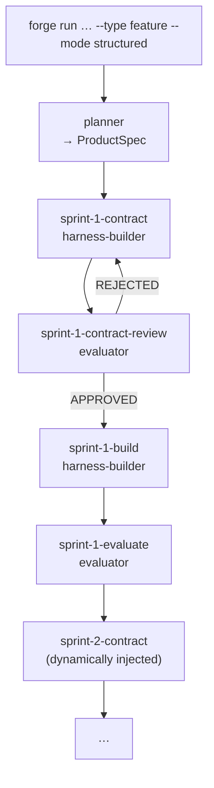

# Harness — the structured execution framework

## User-facing vs internal terminology

When you run `forge run "..." --type feature --mode structured`, you are choosing **structured** mode. Internally, Forge routes this through the **harness** pipeline.

`forge run` is the primary V2.3 submission path. `forge feature create ...` and `forge bug create ...` still work as compatibility aliases, but they are not the main path described in these docs.

- `structured` = the user-facing term. Describes what you experience: planned, checkpointed, reviewable work.
- `harness` = the internal runtime that implements it.

This separation exists so that the user-facing API stays stable while the underlying execution model can evolve. If you are a user, you see `structured`. If you are reading the codebase or debugging, you see `harness`.

---

## What harness does differently

In standard (fast) mode, Forge runs a fixed linear pipeline:

```
intake-gate → architect → builder → quality-guard → devops
```

In structured mode, harness does something more dynamic:

1. A **planner** agent runs first and emits a `ProductSpec` — a schema-validated plan that breaks the feature into a list of sprints.
2. For each sprint, harness runs a four-step cycle.
3. Sprints 2–N are injected dynamically into the pipeline after the planner completes, based on the actual plan.

---

## The harness pipeline

```
planner
  └─ sprint-1-contract          harness-builder proposes what will be built
       └─ sprint-1-contract-review    evaluator approves or rejects the contract
            └─ sprint-1-build         harness-builder implements against approved contract
                 └─ sprint-1-evaluate       evaluator verifies the build result
                      └─ sprint-2-contract  (dynamically injected)
                           └─ ...
```



---

## Agents involved

| Agent | Role |
|---|---|
| `planner` | Decomposes the request into a `ProductSpec` with a feature list and sprint breakdown |
| `harness-builder` | Proposes sprint contracts (Mode 1) and implements code against approved contracts (Mode 2) |
| `evaluator` | Reviews contracts and verifies build results. Outputs `APPROVED` or `REJECTED` with issues |

---

## Artifacts

Each step produces a typed artifact stored in the `IssueWorkProduct` table:

| Artifact | Produced by | Schema |
|---|---|---|
| `ProductSpec` | planner | Feature list + sprint breakdown |
| `SprintContract` | harness-builder (contract phase) | Exact scope for one sprint |
| `BuildResult` | harness-builder (build phase) | Git commit SHA + summary |
| `EvaluationReport` | evaluator | Pass/fail verdict + issues |

---

## Loop-back behavior

If the evaluator rejects a contract, the step loops back to `sprint-N-contract` with the rejection reasons. Maximum revisions per step are configured in the pipeline definition (`maxRevisions`). If the limit is hit, the workflow fails with an error.

---

## Where this lives in the codebase

- Pipeline definition: `src/orchestrator/pipelines/harness.ts`
- Artifact types: `src/orchestrator/harness-artifacts.ts`
- Dynamic sprint injection: `src/orchestrator/dispatcher.ts`
- Agent prompts: `ai-system/official/agents/planner.md`, `harness-builder.md`, `evaluator.md`
